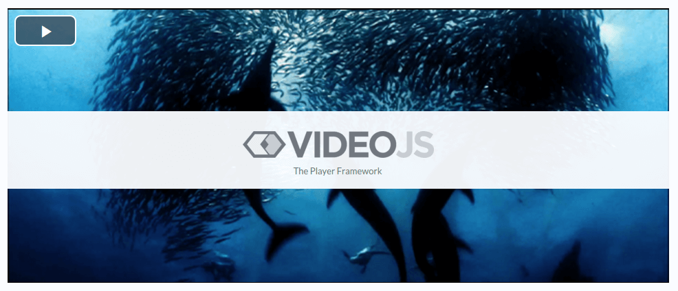

# VideoJS



VideoJS plugin for [Morfy](https://github.com/morfy-cms/morfy) with [Video.js](http://videojs.com/)  

Video.js is a JavaScript and CSS library that makes it easier to work with and build on HTML5 video, today.  

Video.js provides a common controls skin built in HTML/CSS, fixes cross-browser inconsistencies, adds additional features like fullscreen and subtitles, manages the fallback to Flash or other playback technologies when HTML5 video isn't supported, and also provides a consistent JavaScript API for interacting with the video.   

## Installation
See [this instruction](http://morfy.org/documentation/plugins/plugins-installation)

## Usage

In page content
```
{video mp4="http://video-js.zencoder.com/oceans-clip.mp4"}
```

In template
```smarty
{video(['mp4'=>'http://video-js.zencoder.com/oceans-clip.mp4'])}
```

## Parameters

| Name | Description |
| -----|-------------|
| mp4  | MP4 Source  |
| webm | WebM Source |
| ogg  | Ogg Source  |
| poster | Poster image |
| preload | Preload the video? |
| autoplay | Autoplay the video? |
| width | Width |
| height | Height |

## License
See [LICENSE](https://github.com/morfy-cms/morfy-plugin-spolier/blob/master/LICENSE)
